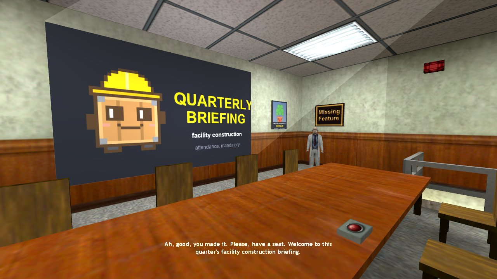
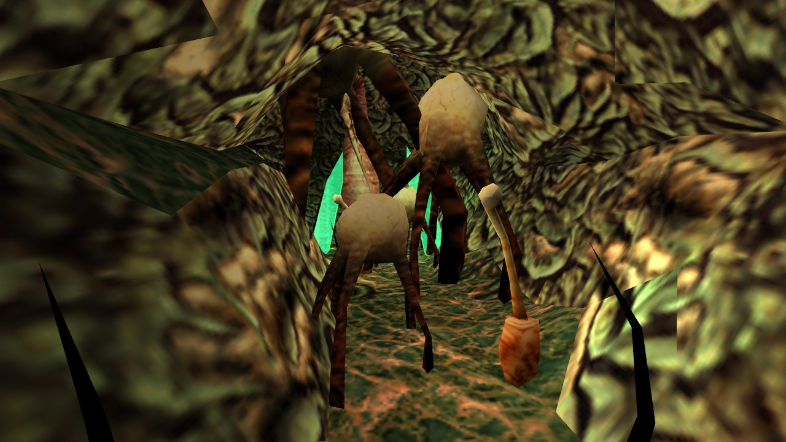
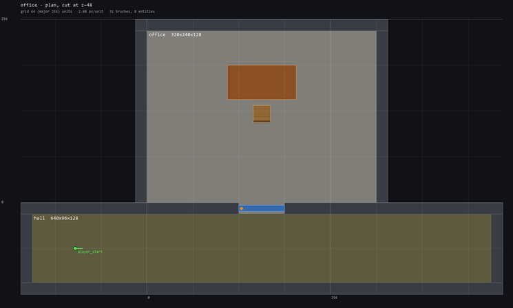

# hlbox

Half-Life (GoldSrc) maps written as Python code. You describe the rooms, doorways,
furniture and lights in a script. `hlmap` generates a Valve 220 `.map`, compiles it
with [SDHLT](https://github.com/seedee/SDHLT), installs it into Half-Life and can take
in-engine screenshots to check the result. It was built so Claude Code can make maps
end to end, but it works fine by hand too.




```python
from hlmap import Map, Level, Material, props

OFFICE = Material(floor="FIFTIES_FLR02C", wall="FIFTIES_WALL14", ceiling="FIFTIES_CEIL01")

def build():
    m = Map("office")
    lvl = Level(wall=16)
    office = lvl.room("office", (0, 0, 0), (320, 240, 128), OFFICE)   # describe the air...
    hall = lvl.room("hall", (-160, -112, 0), (480, -16, 128), OFFICE)
    door = lvl.doorway(office, hall, width=64, height=96)             # ...walls are generated, sealed
    lvl.build(m)
    m.add(props.door_rotating(door, hinge="right"))
    m.add(props.table(160, 168, 0), props.chair(160, 124, 0, facing="north"))
    m.add(props.player_start((-100, -64, 0), facing="east"))
    return m
```

## Requirements

- Windows, with Half-Life on Steam (it's auto-detected from the Steam library folders;
  or set `HL_DIR`)
- Python 3.10+ with Pillow (`pip install -r requirements.txt`)

## Usage

```
python -m hlmap setup                 # download the SDHLT compilers (checksum-verified)
python -m hlmap build office          # maps/office.py -> compile -> install -> build/office/plan.png
python -m hlmap build office --shots  # + in-engine screenshots from the map's CAMERAS
python -m hlmap play office           # launch Half-Life into the map
python -m hlmap tex FIFTIES --sheet   # search textures, render a contact sheet
python -m hlmap preview office --view y --cut 150   # side cutaway
```

`build` also writes a plan-view cutaway, which is handy for checking a layout before
playing it:



## What's in the box

- `hlmap/geometry.py` has brushes (box, prism, wedge, cylinder, convex hull) and
  Valve 220 texture alignment, including "fit texture to face".
- `hlmap/level.py` is the room builder. It carves air volumes out of solid shells,
  so rooms and doorways can't leak, and it textures each face by the room it faces.
  Corridors run at any angle, carved with exact convex CSG (`hlmap/csg.py`). A room
  in the way gets its corner cut: in the office, a 45° corridor slips past the
  storage room to a cafeteria.
- `hlmap/terrain.py` builds open terrain for outdoor areas under a sky: hills and
  lawns as watertight triangle columns (GoldSrc has no displacements). The office's
  cafeteria opens onto a patio and a staff car park with brush-built cars and painted
  bays. There are crossed-plane trees, lamp posts, and a road to a tunnel past a
  security booth whose button raises and lowers a boom barrier.
- `hlmap/cave.py` builds organic caves. A heightfield of simple rock columns follows a
  path out of a doorway. It's watertight by construction, its collision is verified,
  and its materials can change along the way (rock turning into Xen).
- `hlmap/verify.py` checks the compiled map against the intended design:
  - collision holes, invisible walls and missing faces;
  - on-foot walkability, playing every order of pickups and buttons through a
    simulation of the entity logic. Can every area be reached? Can any order lock
    you out?
  - after every step, whether the way on is lit enough to see (from the compiled
    lightmaps).
  `build` won't install a map that fails.
- `hlmap/scene.py` and `hlmap/voice.py` stage talks. In the office, a scientist
  presents a 12-slide briefing with voice lines synthesized at build time, subtitles
  and gestures, timed to the real clip lengths; a power cut stops him mid-sentence.
- `hlmap/logic.py` builds map state out of stock entities: flags (global state),
  conditional relays, timed sequences, and building power. In the office, taking the
  access card trips the breaker: the lights die, red emergency lamps pulse, the
  projector goes dark, and the records door waits for the basement breaker.
- `hlmap/props.py` has furniture (tables, chairs, crates, radios, filing cabinets,
  bookshelves, a vending machine, barrels, pipes, wall art), stairs railings and
  ladders, doors with locks and key pickups, light switches and switchable ceiling
  panels, a projector with toggleable slides, emergency lamps, a breaker lever, Xen
  plants and crystals. There are also Black Mesa style nameplates, posters, stock
  signs and decals, and stencilled words made from stock decal letters.
- `hlmap/wadwrite.py` and `hlmap/art.py` add non-standard textures from any image or
  a pixel-art SVG, embedded in the compiled map.
- `hlmap/compile.py` runs CSG/BSP/VIS/RAD with fast, normal and final profiles, and
  summarizes errors, leaks and how much of each engine limit the map uses. A leak path
  is drawn on the plan preview.
- `hlmap/game.py` installs maps into `valve/maps`. It takes screenshots by loading
  temporary copies of the map with a `trigger_camera` at each camera pose. Each camera
  can first trigger entities: flip light switches, unlock a door, open all doors. Your
  Half-Life video settings are restored afterwards. `playtest` drives the player
  with scripted input and reads back what fired. `playtest --pickups` walks at every
  item to confirm the game picks it up.
- `hlmap/wad.py` reads WAD3 textures and makes contact sheets.
- `hlmap/preview.py` draws orthographic plan and section cutaways.
- `CLAUDE.md` has the workflow, scale numbers, texture and lighting notes, and
  gotchas. `docs/entities.md` is an entity reference.

`install` never overwrites a map it didn't put there, so the stock campaign maps
are safe.
